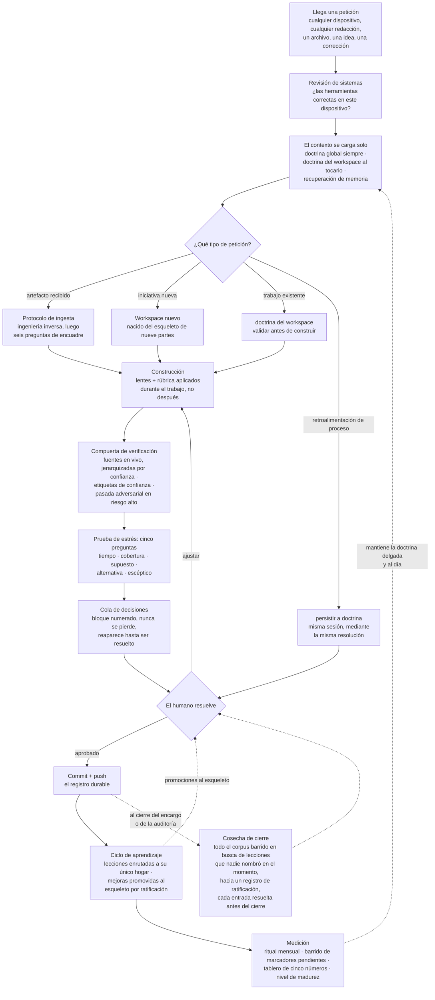
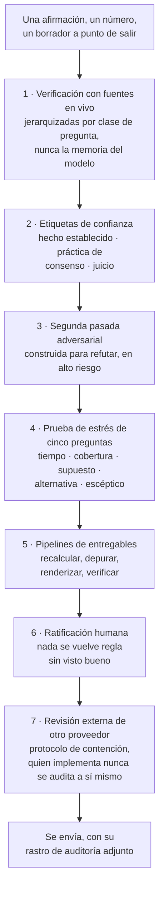
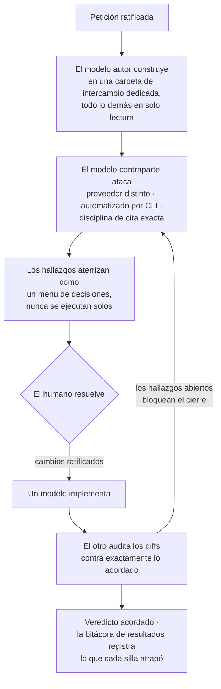
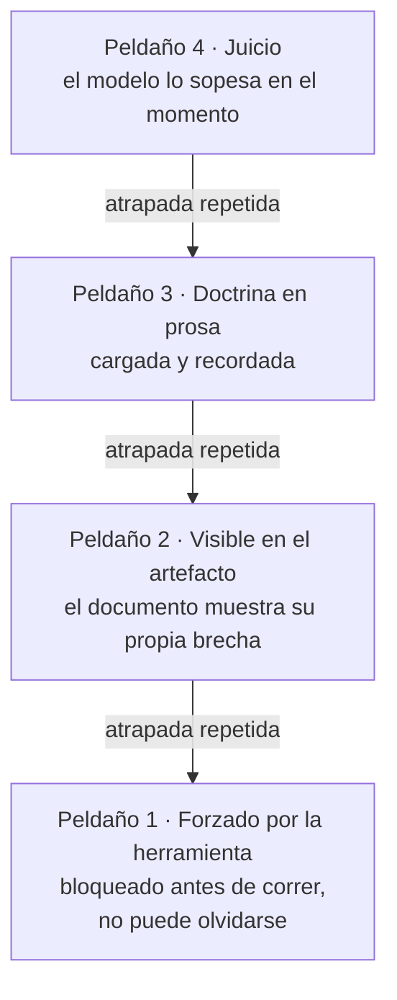
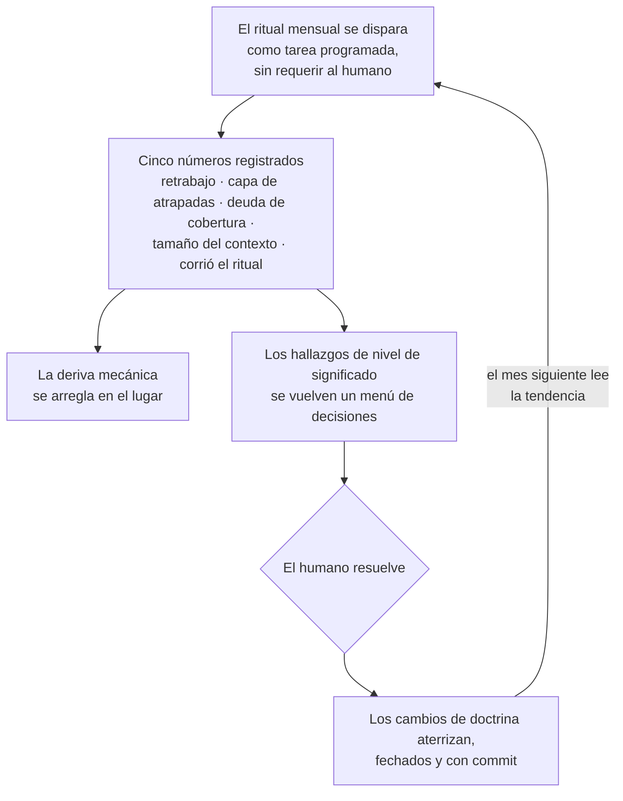

# Operar una IA

## Cómo convertí los chats de IA en un sistema de trabajo, y qué se requiere para operarlo

Jason Lopez

*Edición en español (México), traducida de la versión inglesa en el commit 40494f3. La versión en inglés es la canónica.*

Versión 4, revisada el 2026-08-02. Primer borrador el 2026-07-12; la versión 2
se publicó el 2026-07-16; la versión 3 se publicó el 2026-07-30. Este es un
documento vivo. Se prepara en un repositorio privado y se publica desde uno público
después de una revisión de privacidad. Esta es la edición en español de esta
versión, publicada bajo `es/` en el mismo repositorio, traducida del texto
canónico en inglés, con sus propias compuertas de fidelidad y privacidad
registradas en el historial de revisiones.
Nada de lo que aquí se dice nombra a un cliente, a un colega ni un
precio. Los ejemplos provienen de eventos reales y registrados, presentados como un
entorno de demostración, con las partes ficcionalizadas y las cifras identificadoras
redondeadas. El paquete fue sometido a un ejercicio de red team de reidentificación por un auditor
de otro proveedor con acceso a los registros privados hasta la versión 2; las adiciones de la versión 3
y la versión 4 pasaron por las compuertas de revisión escalonadas registradas en el
historial de revisiones,
y el riesgo residual se declara con claridad en lugar de garantizarse su ausencia. Las personas que participaron en los
eventos subyacentes podrían reconocer sus propias historias; quien lea solamente el
material público no debería poder rastrear ningún ejemplo hasta una persona u
organización real. Las afirmaciones de este documento son juicio del autor salvo que se
cite una fuente.

**La versión de dos minutos.** Pasé casi dos décadas dirigiendo operaciones de seguridad
y respuesta a incidentes, y ahora opero una IA de la misma manera, como una operación
gobernada con doctrina, capas de verificación y un tablero de calificación mensual
en lugar de una ventana de chat. Hace poco atrapó un defecto de puntuación que afectaba aproximadamente a uno de cada seis controles
de un rastreador de cumplimiento, al verificar cada valor contra la fuente oficial
del gobierno. Su primera métrica honesta se publicó en humano dos, máquina cero,
lo que significa que yo atrapé fallas antes que las propias revisiones de la IA, y todo el diseño
existe para invertir ese número. Entre la primera publicación y la revisión de la
versión 2, cuatro días, el registro de correcciones creció de 21 filas a 28,
y la fila más reciente en ese momento fue la primera encontrada por una pasada rutinaria
de la máquina en operación ordinaria, no por mí ni por una revisión comisionada.
Para principios de agosto el registro contenía 53 filas, la primera lectura mensual
del tablero de calificación había corrido puntualmente sin ningún humano presente, y se
publicó tal como este documento prometió que lo haría: los humanos todavía atrapan la
mayoría de las fallas, y el número está en la sección 7. El resto de este
documento cuenta cómo, qué se rompió
en el camino y cuándo escala cada pieza. Las partes son todas ideas públicas.
El ensamblaje es la contribución.

---

## 1. El problema de ser bueno con los prompts

La mayoría de las personas que usan la IA en serio chocan con la misma pared que yo. Cada conversación
empieza desde cero. El modelo le da algo bueno el martes, y para el
jueves ninguno de los dos recuerda cómo llegaron ahí. Las correcciones se evaporan.
La calidad depende de si ese día usted acertó con la manera de plantear las cosas. El
trabajo no se acumula.

Mi trayectoria es en operaciones de seguridad y respuesta a incidentes a escala
empresarial. Colegas que dirigen negocios de servicios administrados me piden ayuda
para crecer y afinar sus ofertas de servicios, y estoy construyendo activamente
el siguiente capítulo de mi carrera. Uso IA en todo eso. No podía permitirme una herramienta que
olvida,
así que dejé de tratar a la IA como un chat y empecé a tratarla como una operación,
con la misma disciplina que aplicaría a un programa de seguridad. Doctrina
documentada. Capas de verificación. Medición. Un rastro de auditoría.

Este documento describe el sistema que salió de esa decisión, lo que
hace por mí y lo que aprendí al construirlo. El sistema corre sobre Claude Code
y un repositorio git privado. El diseño se transfiere conceptualmente a cualquier
entorno de ejecución (harness) que pueda cargar contexto por carpeta, importar archivos y ejecutar comandos
personalizados; las plantillas, tal como se entregan, están dirigidas a Claude Code. El punto no es
la herramienta. El punto es el modelo operativo.

## 2. La forma del sistema

Todo vive en un solo repositorio git privado, organizado en espacios de trabajo (workspaces).
Cada workspace es un dominio de mi vida o de mi negocio con sus propias reglas, sus
propias personas y sus propios archivos de trabajo. Un workspace lleva mi búsqueda de empleo
bajo las reglas más estrictas del sistema, donde cada afirmación del currículum debe
rastrearse hasta un hecho registrado con procedencia, porque una afirmación que no puede
sobrevivir una entrevista es peor que ninguna afirmación. Otro opera la IA como jefe de
gabinete para el trabajo de consultoría que hago con esos negocios de servicios administrados,
conciliando un rastreador vivo con los sistemas de negocio en vivo en cada
sesión. Otro construye y les pone precio a las ofertas de servicios que les ayudo a desarrollar,
donde una estimación nunca llega a un cliente disfrazada de número validado. Otro es mi
asesor técnico y socio de validación, que califica sus propias respuestas
antes de que yo las vea. Otro mantiene cada dispositivo desde el que trabajo configurado
de manera idéntica, y hace poco lo demostró al atrapar una máquina que había acumulado
deriva respecto al estándar. Y uno, este, prepara la historia pública. Un
documento complementario se publica junto con este, con un ejemplo desarrollado de
cada dominio.

El rango del trabajo importa tanto como la estructura. A través de las mismas
compuertas, este sistema produce trabajo técnico de despliegue, configuraciones de identidad y
de endpoints, líneas base de endurecimiento de tenants, secuenciación de migraciones; marcos
de negocio, ofertas de servicios, modelos de precios, personas compradoras; y
planes tácticos de proyecto para cumplimiento, rastreadores de controles, secuenciación
de remediación, planeación de evidencia. Las nueve partes del esqueleto,
descritas en la siguiente sección, no distinguen si el entregable es una
política de endurecimiento o una hoja de precios, y esa indiferencia es deliberada.
Un solo modelo operativo, cualquier dominio de trabajo.

Y el modelo no se limita a lo que ya ha producido. Con las
reglas y los marcos correctos cargados, el mismo esqueleto gobierna directamente el diseño
técnico y la implementación técnica. Un workspace de ingeniería de seguridad
llevaría lentes de arquitectura y una rúbrica de modos de falla, y
sus entregables serían diseños de acceso condicional, lógica de detección y
líneas base de endurecimiento que pasan por las mismas compuertas de verificación que cualquier documento.
Un workspace de operaciones de TI correría anillos de parcheo, líneas base de dispositivos y
runbooks, con la verificación previa al envío parada frente a cada cambio en
producción. Un workspace de reportes podría agregar la postura de vulnerabilidades entre
conjuntos de datos o entre tenancies de clientes, donde la regla de frescura de los números,
cada cifra con su fuente y su fecha, es exactamente lo que separa un
reporte defendible de uno bonito. El marco no cambia. Solo cambian los
lentes, la rúbrica y los detonantes de las compuertas.

La idea clave del diseño es el contexto en capas. Un archivo de instrucciones raíz se carga en
cada sesión y lleva solamente las reglas que siempre deben aplicar, cosas
como "git es la fuente de la verdad", "valide el enfoque antes de construir
cualquier cosa" y "un no honesto le gana a un sí silencioso". Cada workspace lleva un
pequeño archivo cargador que trae su doctrina completa al contexto solo cuando la
IA realmente toca esa carpeta. El material de referencia detallado queda debajo de
eso y se lee bajo demanda. La capa costosa se mantiene delgada, el material profundo se
carga cuando es relevante, y cinco dominios de trabajo más este coexisten
sin contaminarse entre sí.

Git se encarga de recordar. Cada cambio significativo se registra con un commit con un mensaje
claro, cada sesión termina con un push, y la historia es el rastro de auditoría.
Cuando una regla cambia, el archivo cambia en su lugar y git preserva lo que se
creía antes. La doctrina canónica se edita en su lugar, de modo que nunca se bifurca
en copias renombradas; las bitácoras fechadas, los borradores de trabajo y los artefactos entregados
pueden llevar nombres de versión, y esa es toda la taxonomía.

Las máquinas mismas viven bajo la misma disciplina. Un archivo de configuración
canónico y un manifiesto de herramientas definen lo que debe tener cada dispositivo desde el que
trabajo, las identidades de los instaladores se verifican contra fuentes en vivo antes de
entrar al manifiesto, y una revisión de sistemas corre antes de comenzar trabajo
dependiente de herramientas en cualquier máquina. El registro de cada dispositivo lleva un sello fechado de qué tan
al día está respecto al estándar, de modo que la deriva de configuración se atrapa con
maquinaria y no con memoria, por la misma razón por la que existe la administración
de flotillas en cualquier entorno bien llevado.

Así fluye una sola petición a través del sistema.

Dos ciclos alimentan la doctrina con lecciones nuevas, y son deliberadamente
distintos. El ciclo de aprendizaje por petición captura las lecciones que alguien nombra en
el momento, y la retroalimentación de proceso persiste de la misma manera, mediante la
misma resolución. La cosecha de cierre captura las que nadie nombró,
porque los detonantes de captura del sistema eran todos activados por eventos, y
la sección 9 cuenta lo que eso costó. La cosecha también hace cumplir una
distinción que el sistema tuvo que aprender por las malas, aunque la
literatura tiene nombres para ella desde hace tiempo, aprendizaje de doble ciclo en
términos de Argyris, institucionalización en términos de modelos de madurez: una
resolución tomada dentro de una pieza de trabajo gobierna ese trabajo, y decidir en
contexto no es lo mismo que codificar para el futuro. La graduación a
doctrina es un paso propio, a través de su propio registro, resuelto por el
humano. La arista de medición que regresa al contexto poda en lugar de
alimentar; mantiene delgado lo que los dos ciclos agregan.

## 3. El esqueleto

Cada workspace se ajusta ahora al mismo marco de nueve partes, sostenido en un
estándar que ningún workspace posee por sí solo. Un workspace nació de él; los
otros cinco lo precedieron y fueron evaluados contra él ese mismo día, las brechas
que las auditorías encontraron se cerraron, y las desviaciones se nombraron, lo cual es su
propia evidencia de que el marco se adapta retroactivamente a trabajo que ya existe. En términos llanos, las partes son estas.

1. Lentes. Las perspectivas que la IA aplica mientras construye el trabajo, no
   solo al revisarlo después. El lente de un dueño de negocio, el lente de un
   arquitecto de seguridad, un lente de cumplimiento, los que le queden al workspace.
2. Personas. Para quién es realmente el trabajo, por escrito, de modo que todo se
   moldea para un lector real y no para uno genérico.
3. Una rúbrica. Cómo se califica el trabajo antes de enviarse.
4. Controles de error. Cada número que impulsa una decisión lleva su fuente
   y su fecha. Nada que salga se salta una revisión final. Cada sesión comienza
   conciliando el estado actual con el último estado registrado.
5. Un ciclo de aprendizaje. Cuando una corrección o una pieza terminada nos enseña
   algo, se escribe en el archivo correcto para que la siguiente pieza de trabajo
   sea mejor. Las mejoras que merecen ser universales se promueven al
   esqueleto compartido, con mi visto bueno, y con fecha.
6. Un límite declarado. Una oración honesta sobre lo que el sistema no puede hacer. En
   cada workspace dice alguna versión de esto. Un modelo que usa todos los
   sombreros no es revisión independiente. Los datos reales y la corrección del humano son
   las verificaciones más fuertes.
7. Una compuerta de verificación. Cualquier cosa que dependa de un proveedor, una versión, un
   precio o una fecha se verifica contra una fuente en vivo antes de
   afirmarse, nunca desde la memoria del modelo. Las afirmaciones llevan una etiqueta de confianza.
   Las respuestas de alto riesgo reciben una pasada adversarial separada cuyo único trabajo es
   atacar el borrador.
8. Un tablero de trabajo. Cualquier dominio con más de un hilo abierto lleva un
   tablero permanente que la sesión lee antes que cualquier otra cosa, actualizado en el
   mismo commit que el trabajo que rastrea, y cada fila que espera a un humano
   indica cuándo actuar y qué pasa después, de modo que un punto de decisión nunca
   sea una pila sin plan.
9. Un estándar por clase de documento. Cualquier tipo de documento que se va a repetir,
   paquetes para clientes, reportes, guías, especificaciones, recibe un estándar
   escrito de lo que debe lograr una instancia completa más una convención de
   nombres, definido a nivel de la clase antes de que exista la segunda instancia,
   de modo que la calidad sea una propiedad de la clase y no de la instancia
   que casualmente recibió más atención.

El conteo de partes lleva en sí una confesión. Mientras el esqueleto crecía de seis
partes a nueve en cuestión de semanas, la prosa que declaraba el conteo se desincronizó
de la lista de partes tres veces distintas, atrapadas sucesivamente por una
auditoría interna, por la auditoría de un modelo externo y por el ritual mensual,
porque el conteo estaba declarado en varios lugares y la lista vivía en
otro. El arreglo no fue un mejor recordatorio. El acto de agregar una parte ahora
lleva la actualización del conteo como parte de su propia definición, escrita en el
estándar junto a las partes mismas. La regla general vale la vergüenza de la
historia: cuando un hecho se declara en un lugar y se deriva
de otro, los dos van a divergir, y la reparación pertenece al momento del
cambio, no al momento de la revisión.

El esqueleto es una imagen dorada, la configuración patrón, el mismo concepto que uso para endurecer
configuraciones de tenants. Las iniciativas nuevas se estampan a partir de él, el contenido se queda local en
cada workspace, y las desviaciones deben nombrarse en voz alta. Y cuando el esqueleto
mismo cambia, un registro de propagación rastrea la enmienda hacia cada
workspace existente, cada uno actualizado o registrado como ya cubierto
con la razón, de modo que una mejora al marco nunca deje a los workspaces
más viejos varados en una versión anterior.

La propagación ha madurado desde entonces de propuesta a automatización. Cuando un cambio es
mecánico, un comportamiento heredado, un apuntador, una edición que preserva el
significado, se aplica en todos los lugares donde corresponde en la misma sesión,
automáticamente. Cualquier cosa que alteraría lo que significan las reglas ratificadas
propias de un workspace todavía se detiene y espera mi decisión. La capa mecánica se
automatizó y la capa de juicio siguió siendo humana, que es la idea de diseño de
todo el sistema expresada en un solo mecanismo. El vocabulario maduró con
ella. Cuando digo "que eso sea una regla", la frase ahora carga todo un protocolo.
La regla se evalúa en cada capa, el esqueleto compartido, las reglas globales
siempre cargadas, cada workspace y la memoria por dispositivo, y se aplica
dondequiera que quepa en la forma propia de esa capa. Una capa donde no quepa
recibe un veredicto registrado con una razón, nunca una omisión silenciosa.

Un workspace sin
precios dice "aquí no hay libro de precios, y esta es la razón" en lugar de
omitirlo en silencio. La regla que hizo que eso se sostuviera es una de mis favoritas del
sistema. La palabra "parcialmente" nunca puede pasar en silencio. Si la cobertura
es parcial, la IA debe decirlo y, además, abrir la discusión o registrar la
razón.

## 4. La verificación como defensa en profundidad

Pasé años construyendo programas de seguridad sobre el supuesto de que cualquier
control individual con el tiempo terminará por fallar. El mismo supuesto opera este sistema. Siete
salvaguardas de tipos distintos, preventivas, detectivas y de aprobación,
diseñadas para que ninguna falla individual sea silenciosa. No son una cascada
estricta, y contarlas no es lo que importa; lo que importa es que en ninguna
salvaguarda se confía por sí sola. Una matriz de dependencias de controles que mapea sus
traslapes y sus modos de falla compartidos se está construyendo en el repositorio privado,
y las afirmaciones de aseguramiento más fuertes esperan a que exista.

Primero, los hechos se verifican contra fuentes en vivo y no contra la memoria del modelo,
con las fuentes jerarquizadas según la pregunta que se hace. Para hechos de producto, gana la
documentación del proveedor. Para requisitos y comportamiento de protocolos, ganan los
organismos de estándares. Los blogs nunca se sostienen solos, y la memoria del modelo tampoco.
Segundo, las afirmaciones llevan etiquetas para que yo siempre sepa si estoy leyendo un
hecho establecido, una práctica de consenso o un juicio. Tercero, el trabajo de alto riesgo
recibe una segunda pasada adversarial construida para refutarlo. Cuarto, cada propuesta
que me llega para decisión ya fue atacada con cinco preguntas
permanentes. Qué se rompe con el tiempo. Está esto en todos los lugares donde debería estar. Qué estoy
tratando como acordado que nunca se resolvió. Hay una mejor manera. Qué
señalaría un escéptico. Quinto, los entregables tienen sus propios pipelines,
las hojas de cálculo se recalculan y se revisan, los documentos salientes se depuran,
se renderizan y se verifican. Sexto, nada se convierte en regla sin mi
ratificación. Y séptimo, para las decisiones más grandes, un modelo externo revisa
el trabajo bajo un protocolo de contención donde quien implementa nunca audita
sus propios cambios.

Esa última capa existe por la oración más honesta del sistema.
Todas las capas internas son un modelo revisándose a sí mismo, y un modelo puede ser
ciego a sus propios puntos ciegos. El sistema documenta esa limitación en lugar
de esconderla, que es exactamente lo que yo exigiría de cualquier control de seguridad
en el que se me pidiera confiar.

La pila, dibujada como la defensa en profundidad que es.

## 5. Más de una IA en la mesa

Nada en este sistema supone un solo modelo, y las revisiones más rigurosas
deliberadamente no usan uno solo. Cuando una segunda IA de un proveedor
distinto se trae para una segunda opinión, una auditoría o un debate
estructurado, el intercambio corre bajo un protocolo de contención escrito, de modo que
la aportación externa no pueda derivar ni reescribir el sistema en silencio. Las reglas son
pocas y duras. El intercambio vive en una sola carpeta de trabajo dedicada, y
cada uno de los demás archivos del repositorio es insumo de solo lectura, citado pero nunca
editado. Qué puede leer un intercambio es en sí una resolución: traer cualquier
material con datos de clientes a un intercambio es una decisión de divulgación que yo
tomo explícitamente, en el registro, por encargo, nunca por defecto. Los turnos son secuenciales y las rondas tienen tope, de modo que un debate no pueda
alargarse para siempre ni desgastar una protección por repetición. Ningún acuerdo intermedio
entre modelos puede debilitar una regla de honestidad ni mi autoridad de
decisión, porque un punto medio que afloja una protección no es
convergencia, es erosión. La salida es siempre un menú de decisiones para mí,
nunca algo que se ejecuta solo. Y cuando ratifico cambios que salieron
de un intercambio, un modelo implementa y el otro audita los diffs, la comparación
línea por línea, contra exactamente lo que se acordó. El implementador nunca audita su propio
trabajo, una segregación de funciones que cualquier auditor reconocería del control de
cambios humano.

Esto no es teoría. El protocolo ha corrido un intercambio completo de varias rondas con
el modelo de un segundo proveedor, terminando en un conjunto de decisiones ratificado, un
manifiesto de implementación que mapea cada punto acordado a sus commits, y una
auditoría cruzada cuyos hallazgos abiertos bloquearon el cierre hasta resolverse. El
repositorio privado guarda cada ronda.

Desde la versión 3 los asientos de la mesa tienen nombres y una tabla de enrutamiento
escrita. Claude es el autor; es el default para el trabajo con carga pesada de razonamiento y el modelo con el que
está construido este sistema. Codex de OpenAI, operado desde su agente de interfaz de línea de comandos (CLI),
es el auditor adversarial permanente, deliberadamente de un proveedor distinto al del
autor para que ningún modelo califique su propia tarea. El modelo de contexto largo de un
tercer proveedor está asignado a lecturas en frío de documentos completos, listado
honestamente en el registro como instalado pero estacionado hasta que se rehaga su inicio de sesión.
Y para material sensible a la privacidad hay un modelo local en mi propia
máquina, porque algunos datos no deberían cruzar la frontera de un proveedor para ser
analizados. La tabla de enrutamiento empareja cada tipo de trabajo con su modelo y
nombra los detonantes de cambio: cada sesión declara en una línea qué modelo está
corriendo y por qué encaja, la planeación cambia a una contraparte cuando el trabajo
cruza hacia su fortaleza, y cada entregable de alto riesgo recibe una
pasada de contraparte por defecto antes de enviarse. Un límite declarado con claridad,
un modelo no puede cambiar su propio nivel a mitad de sesión, así que esos cambios son siempre
un comando de una línea que se me entrega a mí.

Las pasadas de contraparte dejaron de ser ceremonias de copiar y pegar y se volvieron
corridas automatizadas, operadas desde la línea de comandos bajo las mismas reglas de
contención, que es lo que las hizo lo bastante baratas para ser el default. Y cada pasada
ahora alimenta una bitácora de resultados de cambio de modelo que registra lo que la contraparte atrapó y
el autor pasó por alto, porque un emparejamiento tiene que ganarse su costo con hallazgos o
ser degradado. Las primeras entradas de la bitácora zanjaron una pregunta de diseño con datos.
Sobre el mismo material, el panel de personas lectoras del lado del autor atrapó contradicciones
técnicas profundas que la contraparte no vio, y la contraparte atrapó
clases estructurales que el panel no vio, una rama de diseño obsoleta que había
sobrevivido a un barrido por palabras clave, lenguaje de traspaso que contradecía una resolución de alcance,
afirmaciones exageradas en descripciones de una línea. Ningún validador por sí solo fue
suficiente. La diversidad de tipo de validador le gana a la redundancia del mismo
tipo, lo que cualquier practicante de defensa en profundidad habría predicho y
la bitácora ahora puede demostrar.

La versión más fuerte del patrón es el protocolo de convergencia, nacido
de una directiva de una línea: asegúrate de que los dos modelos estén de acuerdo. La construcción corrió
cinco rondas adversariales hasta un veredicto acordado, y la mecánica es la
lección. Cada ronda vuelve a verificar los arreglos de la ronda anterior con disciplina de
cita exacta, y el conteo de hallazgos solo baja cuando un arreglo es real. Esa
disciplina atrapó algo que un solo modelo habría tapado: dos
arreglos "aplicados" por scripts cuya coincidencia de texto había derivado en silencio nunca
aterrizaron en el documento, mientras los borradores afirmaban que sí. Cada
parche ahora afirma su coincidencia o falla ruidosamente, y la afirmación falsa queda
registrada en la procedencia en lugar de reescribirse para desaparecer. En el mismo
intercambio el auditor atrapó el error de contabilidad del propio implementador,
veintitrés hallazgos donde el implementador contó veintiuno, lo cual
no es una vergüenza, es la razón por la que existe la segunda silla.

## 6. El trabajo del humano

Lo más transferible que he aprendido es que el trabajo del humano en esta
clase de sistema no es hacer prompts. Es la gobernanza. Yo ratifico reglas, muestreo
la salida, y cuando atrapo algo mal, no solo arreglamos la cosa.
Convertimos la corrección en un mecanismo para que la clase de error sea cazada,
no solo la instancia. El registro expone las fallas repetidas, el tablero de
calificación mensual rastrea dónde se atrapan las fallas, y una atrapada repetida (una
atrapada, un error detectado por el humano) se trata como una falla de
mecanismo que fortalece la regla en lugar de duplicarla.

Dos ejemplos de un solo día. Noté que se me seguían pasando decisiones que
quedaban enterradas a la mitad de respuestas largas, así que ahora cada decisión abierta
queda en un bloque numerado al final de cada respuesta y sigue regresando
hasta que yo la resuelvo. Luego atrapé una falla de diseño que la IA debió haber atrapado,
una regla que apuntaba a un blanco móvil, y pregunté qué habría pasado si yo
no hubiera estado poniendo atención. La respuesta se convirtió en la prueba de estrés permanente.
La IA ahora ataca sus propias propuestas con las mismas preguntas que yo habría
hecho, antes de que yo las vea. Mi atención se volvió el respaldo en lugar del
mecanismo.

Desde la primera versión de este documento, el trabajo de gobernanza desarrolló un
extremo de entrada y un extremo de salida. El extremo de entrada es una compuerta permanente. Cualquier
pieza sustantiva de trabajo ahora abre con el plan y los criterios de
validación, es decir, cómo sabremos ambos que la salida es correcta, acordados
antes de construir nada, y el cierre concilia la entrega con
esos criterios. El acuerdo sobre cómo se juzgará la salida resulta valer
más que el acuerdo sobre el texto del plan, porque es aquello contra lo que el
cierre sí se puede medir. La compuerta vino con una regla de diseño
en la que insistí. Una protección siempre activa anuncia cuándo está activa
y lleva una anulación de una frase con alcance a la petición individual, porque una
compuerta que no se puede dispensar se esquiva en lugar de usarse. El extremo de salida
es un libro de peticiones. Cada iniciativa detalla la petición original en la
entrada, registra las adiciones conforme llegan y concilia la entrega con
ambas al cierre. Eso convirtió "esto todavía cumple lo que pedí"
de una pregunta que tengo que acordarme de hacer en una tabla que la responde.

El registro también me enseñó qué significa una repetición. Una regla, nacida de una
atrapada sobre un comando masivo que barrió el trabajo de una sesión paralela hacia un
conjunto de cambios ajeno, falló otra vez al día siguiente. La lección es que una
repetición es un problema de capa, no de redacción. Una regla que vive solamente
en un registro no cambia hábitos de herramienta. Así que el control se empujó hacia abajo
en la pila, primero a la capa de memoria que se carga en cada sesión, y
cuando incluso eso dejó una brecha, a la capa de la herramienta misma, un gancho (hook)
de preejecución que bloquea mecánicamente la clase de comando riesgosa en cada máquina desde la que
trabajo. Esa regla ya no puede fallar por olvido, porque
ya no se recuerda. Se hace cumplir. Vale la pena nombrar la escalera con claridad.
Una regla en un registro es documentación. Una regla en las instrucciones que
se cargan en cada sesión es memoria. Una regla en un gancho de preejecución es
maquinaria. Una atrapada repetida mueve el control un peldaño hacia abajo, lo cual es
defensa en profundidad aplicada a mis propios hábitos.

Otra distinción que solo aprendí al tropezar con ella. Una cola de decisiones
por sesión y un registro entre sesiones son controles distintos, y
tener el primero no le da a usted el segundo. Los puntos abiertos habían llegado a
vivir en cinco lugares distintos, y nada los consolidaba entre
sesiones, así que tuve que preguntar "qué se me está escapando", que es en sí la señal
de que se debe un mecanismo. Cada dominio de trabajo lleva ahora un registro
consolidado de todo lo pendiente, barrido al inicio de cada sesión.
Las decisiones que sobreviven a su sesión aterrizan en él, y los puntos terminados salen.
La cola mantiene honesta a una sola conversación. El registro mantiene honestas a las
semanas.

Hasta la forma en que se formatean las respuestas resultó ser gobernable, y esa
doctrina nació una atrapada a la vez. Yo seguía perdiendo contenido en párrafos
densos, así que la salida estructurada se volvió regla. Una respuesta lista para enviarse llegó una vez
enterrada dentro de comentarios, así que ahora cualquier texto que se espera que yo envíe
a alguien más va solo, en un bloque listo para copiar. Los análisis sustantivos abren con
el veredicto y cierran con mi siguiente acción exacta, porque una respuesta está
terminada cuando el siguiente movimiento del lector ya está en su mano. Y las
reglas de formato enumeradas maduraron con el tiempo hasta una sola prueba,
gramaticalmente correcto para el contexto y que nunca se lea como
escrito por una máquina, que cubre los casos que nadie enumeró. La doctrina que
empieza como una lista de casos y madura hasta ser una prueba es doctrina que escala.

Las atrapadas más recientes muestran qué tan sutil se vuelve el trabajo de gobernanza. Durante un
incidente en vivo, al redactar una actualización para las partes interesadas a partir del resumen de un
miembro del equipo, la IA convirtió "the team will continue reviewing logs" (el
equipo continuará revisando los registros) en "we are also checking logs" (también
estamos revisando los registros), un plan ascendido a trabajo en curso por una edición de
tiempo verbal de dos palabras.
Nadie había confirmado que el trabajo existiera. Lo atrapé con una pregunta, de verdad
estamos haciendo eso, y la regla que produjo es que ningún borrador puede
comprometer al equipo a una acción sin una fuente registrada, sin fuente
la línea se mueve a una lista de sugerencias etiquetada, y las acciones planeadas se quedan en
tiempo de plan. Una IA que redacta en nombre de un equipo no solo corre el riesgo de
inventar hechos. Corre el riesgo de inventar compromisos, y la edición más pequeña basta
para hacerlo.

La misma semana me enseñó que a una compuerta sin alcance declarado se le da la vuelta
por clasificación. Un resumen de investigación salió sin su pasada adversarial porque
la IA decidió que un resumen no era un entregable, y horas después de que esa regla
se endureció, un paquete listo para enviarse hizo el mismo baile con otro
disfraz. El arreglo fue anclar las compuertas a la sustancia de la salida,
cualquier cosa que yo vaya a enviar, ejecutar o entregar a una persona, en lugar de a cómo
se llame a sí misma la salida. Cada compuerta ahora declara sobre qué clase de salida se
dispara, porque una regla que deja la clasificación en manos del gobernado es una
invitación.

Cuando aterrizó la segunda repetición del mismo día, pedí algo distinto,
no otro arreglo sino la mecánica misma de la falla, cómo procesa
realmente las reglas el modelo y dónde están los cuellos de botella. La respuesta se convirtió
en una herramienta de diseño. Las reglas no son cables trampa, compiten por la atención del
modelo, y los hábitos viejos y reforzados le ganan la votación a una regla nueva de una línea a menos que
el texto viejo se reemplace en su lugar. De ahí salió una escalera de confiabilidad
que el registro llevaba semanas subiendo sin nombrarla. Una regla
que vive como juicio es una esperanza. Una regla en doctrina en prosa es memoria.
Una regla que el artefacto mismo hace visible, una sección obligatoria que
brilla por su ausencia cuando se omite, es una revisión que el ojo realiza. Y una
regla que la herramienta hace cumplir antes de que la acción corra es maquinaria que
no puede olvidar. Las reglas nuevas ahora se colocan en un peldaño deliberadamente al
ratificarse, y una atrapada repetida mueve el control un peldaño hacia abajo. Eso
es defensa en profundidad aplicada a mis propios hábitos, y es la misma escalera
que la historia anterior de la capa de herramienta subió un peldaño a la vez.

Dos patrones más que aporto deliberadamente, porque los hábitos del humano
son parte del diseño del sistema. Yo ataco los planes de la IA igual que ella
ataca sus propios borradores; una propuesta reciente de marco fue desafiada tres
veces antes de ratificarse y cada desafío sacó a la luz una mejora
real, lo que dice que la postura adversarial pertenece a ambos lados de
la mesa. Y la mejora aquí tiene dos puertas de entrada, no una. Las lecciones
llegan por la falla, atrapadas y correcciones, pero las mejoras llegan
por la imaginación, y un sistema que solo aprende de sus fallas
mejora más lento que uno que también aprende de sus ideas. Hasta hace poco
aquí solo existía la primera puerta.

Ese patrón, la corrección se convierte en procedimiento, es todo el motor de crecimiento
del sistema. Es también, yo diría, la habilidad real que este documento
exhibe. Cualquiera puede pedirle salida a un modelo. Operar uno significa construir
los ciclos de retroalimentación que hacen confiable la salida los días en que usted está
cansado, distraído o no está mirando.

## 7. Medir el sistema

El trabajo de cumplimiento me enseñó que "estamos seguros" es una pregunta inútil y
"en qué nivel estamos operando, y la tendencia va bien" es una útil.
Así que el sistema se califica a sí mismo con un modelo de madurez de cinco niveles. El nivel uno eran
chats ad hoc y archivos dispersos. El nivel dos era doctrina documentada en git.
El nivel tres, gestionado, es donde evalúo provisionalmente al sistema a la fecha de
este borrador. El sistema corre sobre
mecanismos y no sobre memoria, sobre rituales, registros, colas y
reglas de promoción.
Esa calificación es autoevaluada y provisional; la revisión externa descrita
al final de este documento ya corrió desde entonces, y sus hallazgos están incorporados
en este texto y en el historial de revisiones. El nivel cuatro es
medido, y el nivel cinco es en optimización, donde los números impulsan los
cambios.

La medición es deliberadamente pequeña. Cinco números, registrados una vez al
mes en diez minutos; la primera lectura mensual corrió a principios de
agosto de 2026, y las lecturas que este documento puede sustanciar públicamente,
la capa de atrapadas, el crecimiento del contexto y si el ritual corrió, se
publican abajo, como se prometió, salga como salga. El tablero completo de cinco números
vive en el tablero de calificación privado, y las revisiones futuras publican su tendencia. La tasa de retrabajo en entregables enviados. La capa de atrapadas,
es decir, quién encuentra las fallas primero, las propias pasadas de la IA o yo. La deuda de cobertura,
reglas que no han llegado a todos los lugares donde deberían aplicar. El tamaño del
contexto siempre cargado, que debería mantenerse plano mientras la capacidad crece,
porque la inflación del contexto degrada todo en silencio. Y si el ritual
mensual mismo corrió.

El número de la capa de atrapadas merece un comentario porque su valor inicial es
vergonzoso y ese es el punto. El día uno el marcador fue humano dos,
máquina cero. Yo atrapé dos fallas antes que las propias revisiones de la IA. Para esa
misma noche las capas de auditoría habían atrapado ellas mismas las tres siguientes, así que el
número ya se estaba moviendo; el tablero de calificación mensual mostrará si se mantiene
invertido. En los cuatro días entre la versión 1 y la versión 2 de este
documento, del 2026-07-12 al 2026-07-16, el registro de correcciones creció
de 21 filas a 28. Dos de las siete filas nuevas
eran repeticiones de reglas existentes, que el registro trata como fallas de
mecanismo y responde fortaleciendo la capa, no la redacción; uno de
esos fortalecimientos terminó como el gancho mecánico de capa de herramienta descrito
antes. Y una fila es una primicia. Una omisión de cobertura fue atrapada por la
propia pasada de inicio de sesión del sistema en el curso de la operación ordinaria,
antes de que yo la viera y antes de que mirara cualquier revisión comisionada. Una fila no
invierte una tendencia, pero es el primer dato del lado del libro
que todo este diseño existe para hacer crecer. El sistema registró la línea base
con honestidad, construyó el mecanismo
que debería invertirla y publicará la tendencia. Un sistema que documenta sus propios modos de falla
es más creíble que uno que afirma confiabilidad, en IA exactamente igual que en
seguridad.

La primera lectura oficial ya está en el registro, y cumplió esa
promesa de la manera incómoda. El ritual corrió el 2026-08-01 como una
tarea programada sin ningún humano presente, con su propio archivo de doctrina como su
conjunto de instrucciones, lo cual es en sí el punto: un ritual de mantenimiento que
depende de que alguien lo recuerde no es un mecanismo, es una
intención. Una pasada sin supervisión puede medir, y puede arreglar deriva
mecánica, pero no puede ratificar, así que cerró correctamente con un menú de
decisiones para mí en lugar de con puntos cerrados en silencio. Los números que
registró dicen que la capa de atrapadas sigue siendo mía. De las diecinueve atrapadas
registradas desde una auditoría de seguimiento el 2026-07-17, dieciocho fueron mías y
una vino del campo; las propias pasadas de revisión de la IA aportaron cero,
y dos de las diecinueve fueron repeticiones de reglas existentes, que el
registro califica como fallas de mecanismo. El registro estaba en cincuenta y tres
filas al día siguiente, y la aritmética cierra así: veintiocho
filas en la versión 2, tres más antes de que la auditoría anclara su ventana,
las diecinueve que contó la lectura, y tres atrapadas del mismo día que aterrizaron en
las horas posteriores a la lectura. Un mes de entrega intensa se había sentido productivo mientras la capa de
revisión separada se adelgazaba en silencio, y el tablero de calificación es lo único en
el sistema posicionado para decirlo. Un marco que solo cuenta lo que
construyó siempre reportará éxito. La medida que puede avergonzarlo es
la que vale la pena conservar.

La misma pasada atrapó algo más sutil que un número malo. Un mecanismo
ratificado días antes, un informe semanal, existía en la doctrina y en
ningún otro lado; la tarea programada que de hecho lo dispararía nunca se había
creado, y el ritual lo señaló antes de que llegara su primer lunes.
Esa es la verificación de primer disparo ganándose el pan: un mecanismo está
verificado cuando demostrablemente corre, no cuando su texto aterriza en un archivo,
porque ratificado y corriendo son estados distintos y solo uno de ellos
hace trabajo. La pasada también declinó una optimización que su propia doctrina
sugería, recortar contexto siempre cargado que había crecido doce por ciento,
porque el crecimiento pertenecía a mecanismos que aún no se disparaban ni una vez, y
recortar el portador de un mecanismo no verificado es la manera en que un mecanismo
muere en silencio. La optimización que corre por delante de la verificación no es
optimización. La calificación de madurez se queda en gestionado, ahora con una lectura
medida honesta detrás en lugar de ninguna.

## 8. Un día en el sistema

Una historia concreta del entorno de demostración, eventos reales con las
partes ficcionalizadas. Un rastreador de preparación para cumplimiento, construido con
asistencia de IA para una organización que persigue una certificación federal de
ciberseguridad, aterrizó frente a mí para una segunda opinión. Un artefacto genuinamente bueno, más de
cien controles, estimaciones de esfuerzo por control, un dashboard de puntuación en vivo. Lo solté
en una sesión con dos oraciones de intención, más o menos "averigua dónde
debería vivir esto y haz repetible lo que hiciste con él".

El sistema leyó cada hoja y cada fórmula, registró el archivo con un commit acompañado de
instantáneas en texto plano para volverlo comparable con un diff y revisable, y luego hizo la
cosa que justifica toda la pila de verificación. Notó que la matemática de
puntuación se contradecía a sí misma. La propia leyenda de la hoja citaba el piso oficial de
puntuación, pero los pesos por control no podían producirlo. Un agente en segundo plano
trajo la metodología oficial de puntuación del gobierno desde la fuente
primaria, cotejó cada valor contra una segunda fuente y comparó
cada control. Aproximadamente uno de cada seis llevaba pesos subestimados, todos el
mismo error de captura de datos. El resultado fue una lista de arreglos con la matemática oficial
para defenderla, entregada antes de que los evaluadores de la certificación pudieran encontrar la
brecha por sí mismos.

El mismo día, lo que era un caso único se volvió infraestructura. Ahora existe un protocolo de ingesta
para que cualquier artefacto recibido reciba el mismo tratamiento, ingeniería inversa, un
breve interrogatorio de encuadre, una instancia registrada con commit y una plantilla reutilizable.
La corrección se convirtió en mecanismo, según lo previsto.

## 9. Qué se rompió y qué se ganó a cambio

Una lista corta y honesta, porque las fallas moldearon el sistema más que los
éxitos.

La regla del blanco móvil descrita antes, más una segunda brecha de cobertura el
mismo día, son las dos fallas detrás de la línea base de humano dos, máquina cero.
Agentes de auditoría con contexto aislado, el mismo modelo pero con contexto fresco y sin vista
de las sesiones que produjeron el trabajo, en la práctica una sesión de agente
separada a la que solo se le entregan el artefacto y las instrucciones, atraparon esa misma
noche las tres siguientes, un workspace registrado a medias, una cifra de producción
subcontada en notas destinadas a publicación y un error de redacción en el
estándar mismo, que es el modelo en capas empezando a ganarse el pan. Cada
hallazgo es ahora un modo de falla con nombre que la siguiente revisión busca. Las
fallas repetidas llegaron después y enseñaron la lección de capas contada en la sección 6:
una regla que se repite no falló por estar mal redactada, falló
porque vivía en una capa que podía olvidarla.

Yo también rompí cosas. Se me pasaron decisiones enterradas en la prosa. Olvidé contexto
entre sesiones y pedí cosas que ya existían. Lancé tres
peticiones sin relación en un solo mensaje a las once de la noche. El sistema ahora asume
todo eso como condiciones normales de operación, que es para lo que sirve un modelo
operativo. Está construido para el humano que soy, no para el humano que pretendo ser.

La falla estructural más grande salió a la superficie tarde, y empezó con una
sensación y no con un mensaje de error. El grafo de conocimiento sobre el
repositorio se veía más pequeño y más conectado que antes, y pregunté
si la limpieza había perdido algo. La respuesta forense, desde el historial de
versiones, fue que no: el contenido solo se movió o fue superado, nunca
desapareció, el puñado de eliminaciones tenía todas destinos con nombre, y el
grafo había cambiado porque el enlazado maduró y la vista ocultaba archivos
sin enlazar. Pero la investigación que detonó encontró algo mejor escondido.
Un barrido completo de cada lección reutilizable que los registros del sistema habían
generado alguna vez, quinientas y pico entre archivos de estado, corpus de trabajo
e historial de commits, una población mucho mayor que el registro de
correcciones, que solo contiene atrapadas humanas convertidas en reglas, mostró que la
maquinaria de captura había codificado más de cuatro quintas partes, y la
porción faltante no estaba dispersa al azar. Casi toda estaba como prosa
en los archivos de trabajo de una pieza sustancial de trabajo para un cliente. La causa
raíz fue estructural. Cada detonante de captura que el sistema tenía era
activado por eventos, disparándose con una corrección humana o con una sesión que cambiaba un
mecanismo, y una lección incrustada en el producto de un trabajo de entrega no dispara ninguno de los dos
eventos. Peor, yo había resuelto la mayoría de esos puntos dentro del encargo,
así que a mí me parecían ratificados, mientras nada en el sistema decía que una
resolución en contexto y una codificación a nivel de doctrina son dos actos
distintos. Las reparaciones se convirtieron en las partes permanentes más nuevas del sistema. Una
compuerta de cosecha de cierre, que es la revisión posterior a la acción que cualquier oficina de
proyectos reconocería, aplicada al cierre de encargos y auditorías: nada cierra hasta
que sus lecciones se barren a un registro y cada entrada se resuelve. Un barrido
mecánico mensual de marcadores propuestos, pendientes y estacionados, la misma
revisión de antigüedad que todo sistema de calidad corre sobre sus acciones
correctivas, para que nada señalado espere invisible más de un mes. Y las dos
capas de ratificación, la resolución en contexto y la codificación a nivel de
doctrina, ahora nombradas como actos separados en la doctrina de ingesta. Un
residual declarado con claridad, porque las reparaciones no lo cubren todo: un
encargo de larga duración todavía puede acumular deuda sin marcar hasta que su
cosecha de cierre se dispare, y acotar eso es una siguiente iteración, en el
registro. Lo que la falla compró es una lección que todo programa de auditoría ya
conoce, afilada por vivirla en carne propia: un sistema de captura activado por eventos
acumula deuda exactamente donde ningún evento se dispara, y la cura es un
barrido programado que asume que el silencio esconde algo. La parte filosa
es que yo había construido la mitad activada por eventos y omitido la mitad
programada, en un sistema explícitamente modelado sobre la defensa en profundidad.

El primer barrido programado demostró el punto al encontrar dos reglas que habían
entrado sin pasar por la puerta principal. Una había sido escrita directamente en la
capa de memoria de un dispositivo como una preferencia callada semanas antes, disparándose en
cada sesión de esa máquina mientras el registro de doctrina no sabía nada
de ella. Otra sesión había producido veinticinco commits, incluido un
cambio a la configuración canónica, y no había escrito ninguna entrada de captura. Ambas
fallas comparten una causa raíz que vale la pena nombrar. El pipeline de ingesta se detona
cuando alguien dice que eso sea una regla, y con correcciones registradas como
atrapadas; una regla que llega como preferencia de pasada a la mitad de una
entrega no toca ninguno de los dos cables. La sesión creadora de mecanismos que no
se siente como sesión de doctrina es el punto ciego, y el barrido programado
es ahora la red debajo de él.

## 10. Dónde se ubica esto entre lo que ya es público

Antes de afirmar que algo de esto es diferente, hice escanear el ecosistema en una
pasada acotada y estructurada, con cada fuente citada verificada en vivo y no
recordada. El escaneo completo con enlaces y su nota de método se publica junto con
este documento en el repositorio público. La versión corta es que cada pieza
de este sistema tiene un vecino cercano en alguna parte. Directorios curados como
awesome-claude-code reúnen cientos de configuraciones de Claude Code. Los sistemas de
workspace personales organizan la vida y el trabajo en carpetas que una IA puede navegar.
El texto de un abogado trata la verificación de las afirmaciones de la IA como un deber
profesional, que es lo más cercano que encontré a la pila de verificación de aquí. Un
repositorio publica análisis post-mortem honestos de fallas de IA. Y los modelos de
madurez empresariales de MITRE y Microsoft califican a organizaciones que adoptan IA.

Lo que no encontré, en las fuentes y búsquedas listadas al 2026-07-12,
es el ciclo cerrado. Doctrina mantenida
deliberadamente contra la degradación según un calendario. Un modelo de madurez y un
tablero de calificación mensual aplicados a la práctica de una sola persona en lugar de a una empresa.
Fallas retroalimentadas a las reglas rectoras como modos de falla con nombre. Y un
modelo formal de autoridad humana, donde nada se vuelve regla sin
ratificación y ningún implementador audita su propio trabajo. Esa combinación es
la afirmación que hace este documento, y los conceptos sobre los que construye, context
engineering (ingeniería de contexto), rutas doradas, defensa en profundidad, evaluación con modelo juez, son
ideas establecidas acreditadas en el estudio. El ensamblaje es la contribución.

Los mecanismos de la versión 3 son posteriores a ese escaneo. Sus vecinos más cercanos se
nombran donde aparecen, las revisiones posteriores a la acción para la cosecha de cierre,
las revisiones de antigüedad de acciones correctivas para el barrido de marcadores, el
aprendizaje de doble ciclo y la institucionalización de los modelos de madurez para la
distinción entre resolver y codificar, y se reclaman, como
todo lo demás aquí, solo como ensamblaje. Los mecanismos de la versión 4, la
tabla de enrutamiento de modelos, el despacho por capacidad en la entrada, la regla de
verificación de primer disparo, igualmente son posteriores al escaneo; los vecinos nombrados aquí para
ellos, la asignación de turnos en operaciones, la planeación basada en capacidades y las
pruebas de puesta en marcha que cualquier marco de control corre antes de confiar en un nuevo
control, son créditos informales del autor y no resultados del estudio,
y los mecanismos se reclaman, como siempre, solo como ensamblaje. Una nota permanente sobre los nombres: los nombres
locales de este documento son etiquetas de uso, no reclamos de novedad; donde un
mecanismo tiene un nombre establecido, el texto lo acredita.

## 11. Cómo escala esto y qué detona cada paso

Hoy todo corre sobre archivos markdown en git más el propio harness de la IA,
y ese es un techo deliberado, no una limitación que nadie notó. La
regla rectora es que graduamos el almacenamiento, nunca la doctrina, y
cada paso hacia arriba espera a que su detonante realmente se dispare. La
infraestructura prematura es inflación vestida con un disfraz de productividad. Aquí está la escalera
tal como está, con el estado honesto de cada peldaño.

Los agentes ya están en uso. Cuando el trabajo es independiente, contenido y
paralelizable, va a agentes en segundo plano en lugar de a la sesión principal.
Las auditorías de workspaces descritas antes corrieron como agentes paralelos de solo lectura,
y la verificación de puntuación corrió como un agente de investigación con acceso a la web. La
razón más profunda no es la velocidad. Un agente que audita trabajo no debería compartir
contexto con la sesión que produjo el trabajo, que es la misma regla de
ojos frescos que yo aplicaría a cualquier revisión humana. El detonante para
lanzar un agente es simple. Si la tarea puede describirse por completo en unas
instrucciones, no necesita mi juicio a mitad de vuelo y se beneficia de ojos frescos
o de paralelismo, se convierte en agente. El aislamiento en sí es barato. Un
agente fresco recibe el artefacto y las instrucciones y nada más.

Los conectores y los servidores MCP vienen después. Hoy el sistema lee mis sistemas de
negocio en vivo pero en solo lectura, a través de conectores existentes, y eso es
suficiente. Un servidor MCP a la medida se gana su lugar el día en que más de una herramienta o
sesión necesite acceso programático a los mismos datos en vivo, por ejemplo cuando
los rastreadores de clientes necesiten alimentar una capa de reportes mientras las sesiones también los
consultan. Hasta ese día, construir uno sería infraestructura sin cliente.

El peldaño de la base de datos tiene tipos, y el tipo sigue a la pregunta que se
hace. Un almacén relacional, y para un sistema de este tamaño eso significa SQLite, un
archivo único que no necesita servidor, se vuelve correcto cuando necesitemos consultas reales
sobre cientos de filas estructuradas, como cada punto de remediación abierto
en cada rastreador de cliente con vencimiento este mes. Un almacén de documentos encaja cuando los
registros son estructurados pero heterogéneos, que es aproximadamente lo que los archivos de
estado JSON ya hacen en miniatura. Una base de datos vectorial, que almacena
significado en lugar de campos y recupera por similitud, se vuelve relevante
solo cuando los aprendizajes y validaciones acumulados rebasen la búsqueda simple, y
la búsqueda simple no ha estado ni cerca de romperse. El tablero de calificación son cinco
números al mes y no justifica un almacén de series de tiempo.
Nombrar
lo que no vamos a construir es tan parte del plan de escalamiento como nombrar
lo que sí.

Un límite nombrado con claridad, porque un modelo operativo que suena completo
invita a suponer que lo cubre todo. Este esqueleto gobierna cómo
se produce y se verifica el trabajo con IA. No aporta modelado de amenazas, clasificación de
datos, manejo de secretos, control de acceso, respuesta a incidentes,
pruebas de respaldo, reglas de retención y eliminación, fronteras contra inyección de prompts,
reversión, propiedad de controles, expiración de excepciones, estándares de evidencia ni
aplicación automatizada; esos viven en el entorno que lo rodea, y quien
adopte el marco debería traerlos.

Una interfaz de usuario va al final, y es una decisión de producto más que de
almacenamiento. Se vuelve correcta solo cuando humanos distintos de mí necesiten ver
dentro del sistema, un portal de clientes o un dashboard de equipo. Multiusuario es el
umbral real ahí, porque en el momento en que un segundo humano depende del
sistema, el modelo de ratificación y el rastro de auditoría tienen que servirle también a esa persona.

El ritmo de medición es mensual y la tendencia será pública en revisiones
futuras de este documento. Y antes de que se publicara la primera versión, el sistema mismo pasó por una
revisión adversarial de tres rondas por el modelo de otro proveedor bajo el
protocolo de contención, así que las afirmaciones de aquí llevan una verificación de un modelo
que no comparte el entrenamiento ni las herramientas del autor, lo que reduce
la probabilidad de un punto ciego compartido sin eliminarla. La cota honesta
declarada junto a ella: el
revisor es de otro proveedor y de contexto fresco, y aun así fue comisionado,
delimitado y adjudicado por el autor, lo cual es menos que una independencia
plena y más que una autorrevisión. Sus hallazgos están incorporados en
este texto y registrados en el historial de
revisiones.

Este documento comenzó el mismo día en que el sistema fue evaluado
provisionalmente en madurez gestionada. El estudio de trabajos previos se envía con este paquete; las revisiones
llevan las tendencias del tablero de calificación y lo que la auditoría externa encuentre. Si los números me avergüenzan,
se publican de todos modos. Ese es el estándar con el que corre todo el sistema, y es
el mismo estándar que he llevado en cada programa de seguridad que he
dirigido. El sistema se construyó con Claude. Lo opera un humano que firma
cada regla.

---

## Historial de revisiones

Este documento describe un sistema vivo, así que lleva su propio registro de
cambios, y el ritual mensual de mantenimiento del sistema incluye comprobar que
este documento todavía dice la verdad sobre él. Qué cambió, cuándo y por qué
es parte de lo que se exhibe.

Versión 1, 2026-07-12. Primer borrador completo, escrito el día en que el sistema
fue evaluado provisionalmente en madurez gestionada. Esa misma noche, un panel de
lectura en frío de cuatro personas lectoras
revisó el borrador y sus ediciones jerarquizadas se aplicaron. Incluyeron un
error en el conteo de workspaces y una inconsistencia sobre quién atrapó primero una falla
de diseño (ambos encontrados por el panel, ambos corregidos), el resumen de dos minutos movido
al inicio,
las siete capas de verificación hechas contables, la jerarquía de confianza declarada por
clase de pregunta, la calificación de madurez autoevaluada matizada donde se
afirma, y diversa hipérbole recortada. La resolución de privacidad del caso de
estudio está resuelta. Los ejemplos públicos usan un entorno de demostración
ficcionalizado con cifras redondeadas, y los eventos reales quedan registrados en el
repositorio privado. También se agregó la misma noche por indicación del autor un complemento
de ejemplos, una viñeta ficcionalizada por dominio, para que cada workspace
demuestre y no solo describa; el posicionamiento del autor
corregido para declarar la relación real (asesor de negocios de servicios
administrados, no operador de uno); y dos
secciones cuya ausencia atrapó el autor, el estándar de dispositivos y herramientas y
el protocolo de colaboración multi-IA con su separación autor-auditor.
Esa atrapada de completitud también se volvió una regla permanente de la rúbrica, cada borrador se
barre ahora contra el inventario completo del sistema antes de llamarse terminado.
Tarde esa misma noche el borrador revisado se volvió a pasar por el panel según la
regla de revisión material, veredicto listo tras arreglos, nueve aplicados (una
inconsistencia de ventana de métricas conciliada, historias duplicadas comprimidas,
pulido), y el autor resolvió que el caso de estudio se generalizara un paso más
al estrechar su detalle identificador; la garantía categórica de privacidad fue
reemplazada después por la divulgación acotada de solo material público declarada en
la apertura. Antes de la publicación, una auditoría de contención de tres rondas
con otro proveedor corrió hasta completarse: se levantaron dos bloqueadores de privacidad y
un conjunto de correcciones de afirmaciones exageradas, y cada hallazgo fue resuelto
o explícitamente decidido por el autor en este texto. Para revisiones
futuras quedan planeadas las tendencias del tablero de calificación del ritual mensual.

Versión 2, 2026-07-16. Primer ciclo de revisión desde la publicación, corrido por
el mismo pipeline que el documento describe: barrido de captura de la bandeja
privada, borradores preparados, una repetición de la lectura en frío de cuatro personas lectoras
porque una revisión material es un borrador nuevo, la depuración de privacidad como
pasada con nombre, y la aprobación del autor del texto exacto antes de mover
nada. Qué
cambió. La historia de propagación de la sección 3 actualizada de proponer al siguiente
toque a propagación automática con la división entre lo que preserva el significado y lo que
lo altera, más el significado de pila completa que ahora carga la frase "que eso sea
una regla". La sección 6 ganó cuatro mecanismos nacidos desde la primera
publicación: la compuerta de plan primero con criterios de validación acordados antes de
la construcción y su anulación de una frase con alcance limitado; el libro de peticiones que
concilia la entrega con la petición original; la lección de capas de la
atrapada repetida que terminó con una regla recordada reconstruida como guarda mecánica
en la capa de herramienta; y la distinción entre una cola de decisiones por sesión
y un registro entre sesiones de puntos abiertos. También ganó la
doctrina de comunicación que maduró de reglas de formato enumeradas a
una sola prueba. La sección 7 registra el crecimiento del registro de 21 filas a 28
y la primera atrapada encontrada por la pasada rutinaria de la propia máquina y no
por el autor. El complemento de ejemplos ganó una viñeta de elicitación diseñada y
recálculo desde la fuente en el dominio de ofertas y la guarda de capa de herramienta
en el dominio de dispositivos, y cada versión derivada (rendition) declara ahora de qué revisión
de este documento deriva. El panel repetido no levantó bloqueadores y
sus arreglos jerarquizados se aplicaron antes de la aprobación, entre ellos un desajuste de ventana
de métricas entre versiones derivadas y la redacción de la primera atrapada encontrada por la máquina.
Por qué existe esta revisión: el sistema se movió, y la regla permanente es
que a este documento no se le permite alejarse de él.

Versión 3, 2026-07-30. Preparada y revisada por el mismo pipeline que el
documento describe, corrido hasta completarse: el barrido de captura de la bandeja
privada, borradores preparados, la lectura en frío de cuatro personas lectoras contra el
texto preparado cuyos hallazgos se aplican en esta versión, la depuración de privacidad como
pasada con nombre, y la aprobación del autor del texto exacto, incluidas sus
resoluciones sobre los tres puntos que levantó la lectura de privacidad (la oración de
divulgación entre proveedores agregada a la sección 5, el detalle de régimen del caso de
estudio retenido bajo la resolución de la versión 1, y las autorrevelaciones del autor
retenidas). Qué cambió. El diagrama de flujo de la sección 2 ganó el ciclo de la cosecha de cierre, el
nodo de medición ganó el barrido de marcadores pendientes, y la
ruta de retroalimentación de proceso se redibujó a través de la resolución del humano después
de que el panel la atrapó saltándose la ratificación en la página. Un pasaje nuevo nombra
los dos ciclos que alimentan la doctrina y la distinción entre decidir y codificar,
con su linaje acreditado. La sección 9 ganó la falla estructural más
grande del sistema hasta la fecha, contada con honestidad: la deuda de captura activada por
eventos que dejó una porción concentrada de lecciones sin extraer en
los archivos de trabajo de un encargo, por qué el autor creyó razonablemente que ya
estaban ratificadas, las tres reparaciones permanentes, y el residual declarado
que las reparaciones no cubren. La sección 10 ganó la anotación de crédito
para los mecanismos de la versión 3, que son posteriores a su escaneo de trabajos
previos. El panel también atrapó, en el borrador preparado antes de la publicación: una
inconsistencia aritmética en los propios conteos del pasaje nuevo, la parte
preliminar del documento llamándose todavía versión 2, y ventanas de métricas congeladas en
valores de la versión 2, cada una corregida en este texto y cada una una instancia de una
clase de falla que este documento afirma eliminar con mecanismos, que es el panel
ganándose el pan. Los identificadores siguen la divulgación acotada declarada en
la apertura. El mismo día, horas después de que esta versión se publicó por primera vez, el
barrido de clase del refresco del kit de inicio atrapó que el documento todavía describía
el esqueleto como de siete partes aunque el tablero de trabajo había sido ratificado como
parte 8 el 2026-07-28: la sección 3 ganó su octavo punto, cada versión derivada
dice ahora ocho, y el kit incluye la plantilla de ocho partes. El panel no lo
había atrapado porque ningún lector en frío puede conocer una parte que el texto nunca
menciona, lo cual vale la pena registrar en sí mismo: las revisiones encuentran contradicciones
internas, solo la conciliación con el sistema fuente encuentra omisiones. Por qué
existe esta revisión: la misma regla que la versión 2, el sistema se movió.

Versión 4, 2026-08-02. Preparada y revisada por el mismo pipeline:
barrido de captura de la bandeja privada contra el texto publicado, una lista
escrita de deltas que registra cada adición con su fuente, borradores preparados, la
lectura en frío de cuatro personas lectoras, una pasada adversarial de otro proveedor corrida desde la
línea de comandos, la depuración de privacidad como pasada con nombre, y la
aprobación del autor, que este ciclo tomó una forma distinta y se registra
con claridad porque el estándar de aprobación es parte de lo que se exhibe: el
autor aprobó el pipeline y sus compuertas registradas de manera prospectiva
en lugar de leer el texto exacto línea por línea, una primera vez para este
documento, con la pasada de otro proveedor supliendo la verificación a nivel de texto
que su lectura habría aportado de otro modo. Qué cambió. El esqueleto llegó a nueve partes
con el estándar por clase de documento, y la sección 3 ahora cuenta la
historia de la deriva del conteo con honestidad como una recurrencia de tres veces con la reparación
movida al momento del cambio. La sección 5 creció de una descripción de
protocolo a la operación multimodelo completa: el elenco con nombres y la
tabla de enrutamiento, las pasadas automatizadas entre proveedores, la bitácora de resultados de
cambio de modelo y su hallazgo de que la diversidad le gana a la redundancia, y el protocolo de
convergencia con la lección del parche silencioso. La sección 6 ganó los patrones de
gobernanza más nuevos: la atrapada del ascenso de tiempo verbal y la
regla de trazabilidad de compromisos, la evasión por clasificación y las
compuertas con alcance declarado, la escalera de confiabilidad ahora usada como herramienta de
colocación al ratificar, la postura adversarial del humano hacia los planes de la
IA, y el ciclo de aprendizaje de dos puertas. La sección 7 publicó la primera
lectura oficial del tablero de calificación, una corrida sin supervisión cuyo número de capa de atrapadas
fue en la dirección equivocada y se publicó de todos modos, junto con la
atrapada de que ratificado no es lo mismo que corriendo y el hallazgo de mesura. La sección 9
ganó el punto ciego de la entrada por canal lateral. Se agregaron cuatro diagramas,
la pila de verificación, el flujo de intercambio, la escalera de confiabilidad y
el ciclo de medición, y se corrigió el conteo de partes obsoleto del diagrama de
flujo. Esta versión también introduce la edición en español (México)
bajo `es/`, traducida del texto exacto de esta versión bajo un
estándar de traducción con su propio diff mecánico de fidelidad,
auditoría de fidelidad de otro proveedor y depuración de privacidad independiente; el inglés
sigue siendo canónico, cada archivo en español registra el commit inglés al que da
seguimiento, y cada revisión futura lleva la pasada en español en el mismo
ciclo. Por qué existe esta revisión: el sistema se movió, y esta vez el
público lector se amplió.
