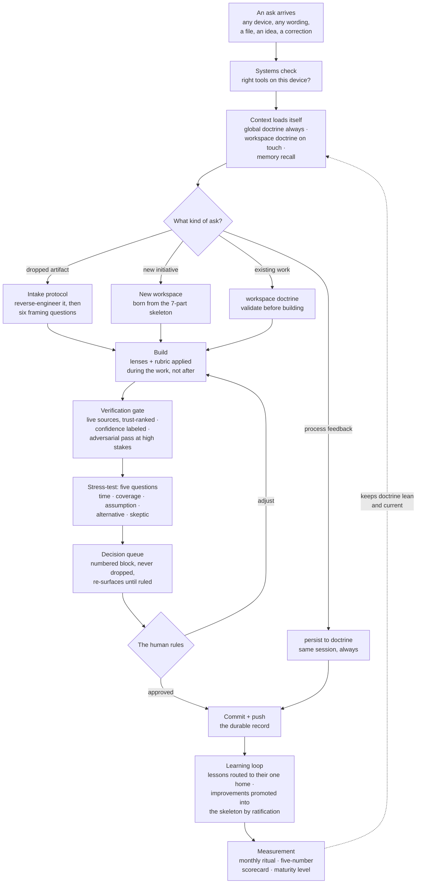

# Operating an AI

## How I turned AI chats into a working system, and what it takes to run one

Jason Lopez

Version 2, revised 2026-07-16. First drafted 2026-07-12. This is a living
document. It stages in a private repository and publishes from a public one
after a privacy review. Nothing here names a client, a colleague, or a
price. Examples are drawn from real, recorded events and presented as a
demonstration environment, parties fictionalized and identifying figures
rounded. The package was red-teamed for re-identification by a cross-vendor
auditor with access to the private records, and the residual risk is stated
plainly rather than warranted away. People who participated in the
underlying events may recognize their own stories; readers of the public
material alone should not be able to trace any example to a real person or
organization. Claims in this document are the author's judgment unless a
source is cited.

**The two minute version.** I spent nearly two decades running security operations
and incident response, and now I run an AI the same way, as a governed
operation with doctrine, verification layers, and a monthly scorecard
instead of a chat window. It recently caught a scoring defect affecting roughly one in six controls
of a compliance tracker, by checking every value against the official
government source. Its first honest metric published at human two, machine zero,
meaning I caught flaws before the AI's own reviews did, and the whole design
exists to invert that number. In the four days since first publication the
register of corrections has grown from 21 rows to 28, and the newest row is
the first found by a routine machine pass in ordinary operation, not by me
and not by a commissioned review. The rest of this
document is how, what broke
along the way, and when each piece scales. The parts are all public ideas.
The assembly is the contribution.

---

## 1. The problem with being good at prompting

Most people who use AI seriously hit the same wall I did. Each conversation
starts from zero. The model gives you something good on Tuesday, and by
Thursday neither of you remembers how you got there. Corrections evaporate.
Quality depends on whether you happened to phrase things well that day. The
work does not compound.

My background is security operations and incident response at enterprise
scale. Colleagues who run managed services businesses ask for my help
growing and sharpening their service offerings, and I am actively building
my next career chapter. I use AI across all of it. I could not afford a tool that
forgets,
so I stopped treating AI as a chat and started treating it as an operation,
with the same discipline I would apply to a security program. Documented
doctrine. Verification layers. Measurement. An audit trail.

This document describes the system that came out of that decision, what it
does for me, and what I learned building it. The system runs on Claude Code
and a private git repository. The design transfers conceptually to any
harness that can load context by folder, import files, and run custom
commands; the templates as delivered target Claude Code. The point is not
the tool. The point is the operating model.

## 2. The shape of the system

Everything lives in one private git repository, organized into workspaces.
Each workspace is a domain of my life or business with its own rules, its
own personas, and its own working files. One workspace runs my job search
under the strictest rules in the system, where every resume claim must
trace to a registered fact with provenance, because a claim that cannot
survive an interview is worse than no claim. One runs the AI as chief of
staff for the consulting work I do with those managed services businesses,
reconciling a living tracker against their live business systems every
session. One builds and prices the service offerings I help them develop,
where an estimate never reaches a client dressed up as a validated number. One is my
technical advisor and validation partner, which grades its own answers
before I see them. One keeps every device I work from configured
identically, and recently proved it by catching a machine that had drifted
behind the standard. And one, this one, stages the public story. A
companion document publishes alongside this one with a worked example from
each domain.

The range of the work matters as much as the structure. Through the same
gates, this system produces technical deployment work, identity and
endpoint configurations, tenant hardening baselines, migration sequencing; business
frameworks, service offerings, pricing models, buyer personas; and
tactical project plans for compliance, control trackers, remediation
sequencing, evidence planning. The seven parts of the skeleton,
described in the next section, do not care whether the deliverable is a
hardening policy or a pricing sheet, and that indifference is deliberate.
One operating model, any domain of work.

And the model is not limited to what it has already produced. With the
right rules and frameworks loaded, the same skeleton governs technical
design and technical implementation directly. A security engineering
workspace would carry architecture lenses and a failure-mode rubric, and
its deliverables would be conditional access designs, detection logic, and
hardening baselines passing the same verification gates as any document.
An IT operations workspace would run patch rings, device baselines, and
runbooks, with the pre-flight check standing in front of every production
change. A reporting workspace could aggregate vulnerability posture across
data sets or across client tenancies, where the number-freshness rule,
every figure carrying its source and date, is exactly what separates a
defensible report from a pretty one. The frame does not change. Only the
lenses, the rubric, and the gates' trigger points do.

The key design idea is layered context. A root instruction file loads into
every session and carries only the rules that must always apply, things
like "git is the source of truth," "validate the approach before building
anything," and "an honest no beats a quiet yes." Each workspace carries a
small loader file that pulls its full doctrine into context only when the
AI actually touches that folder. Detailed reference material sits below
that, read on demand. The expensive layer stays thin, the deep material
loads when it is relevant, and five working domains plus this one coexist
without bleeding into each other.

Git does the remembering. Every meaningful change is committed with a clear
message, every session ends pushed, and the history is the audit trail.
When a rule changes, the file changes in place and git preserves what was
believed before. Canonical doctrine is edited in place, so it never forks
into renamed copies; dated logs, working drafts, and delivered artifacts
may carry version names, and that is the entire taxonomy.

The machines themselves live under the same discipline. A canonical
settings file and a tool manifest define what every device I work from must
have, installer identities are verified against live sources before they
enter the manifest, and a systems check runs before tool-dependent work
begins on any machine. Every device's record carries a dated stamp of how
current it is against the standard, so configuration drift gets caught by
machinery instead of by memory, for the same reason fleet management
exists in any well-run environment.

Here is how a single ask flows through it.

## 3. The skeleton

Every workspace now conforms to the same seven-part frame, held in a
standard that no single workspace owns. One workspace was born from it; the
other five predated it and were assessed against it the same day, the gaps
the audits found were closed, and the deviations were named, which is its
own evidence the frame retrofits onto work that already exists. In plain terms the parts are these.

1. Lenses. The perspectives the AI applies while building the work, not
   just when checking it afterward. A business owner's lens, a security
   architect's lens, a compliance lens, whichever fit the workspace.
2. Personas. Who the work is actually for, written down, so everything is
   shaped for a real reader instead of a generic one.
3. A rubric. How the work gets graded before it ships.
4. Error controls. Every number that drives a decision carries its source
   and date. Nothing outbound skips a final check. Every session starts by
   reconciling against the last recorded state.
5. A learning loop. When a correction or a finished piece teaches us
   something, it gets written into the right file so the next piece of work
   is better. Improvements that deserve to be universal get promoted into
   the shared skeleton, with my sign-off, and dated.
6. A stated limit. One honest sentence about what the system cannot do. In
   every workspace it says some version of this. One model wearing all the
   hats is not independent review. Real data and the human's correction are
   the strongest checks.
7. A verification gate. Anything that depends on a vendor, a version, a
   price, or a date gets verified against a live source before it is
   stated, never from the model's memory. Claims carry a confidence label.
   High-stakes answers get a separate adversarial pass whose only job is to
   attack the draft.

The skeleton is a gold image, the same concept I use for hardening tenant
configurations. New initiatives are stamped from it, content stays local to
each workspace, and deviations must be named out loud. And when the skeleton
itself changes, a propagation registry tracks the amendment out to every
existing workspace, each one either updated or recorded as already covered
with the reason, so an improvement to the frame never strands the older
workspaces on an older version of it.

Propagation has since matured from proposal to automation. When a change is
mechanical, an inherited behavior, a pointer, an edit that preserves
meaning, it is applied everywhere it belongs in the same session,
automatically. Anything that would alter what a workspace's own ratified
rules mean still stops and waits for my decision. The mechanical layer got
automated and the judgment layer stayed human, which is the design idea of
the whole system expressed in one mechanism. The vocabulary matured with
it. When I say "make that a rule," the phrase now carries a whole protocol.
The rule is assessed at every layer, the shared skeleton, the always-loaded
global rules, each workspace, and the per-device memory, and applied
wherever it fits in that layer's own form. A layer where it does not fit
gets a recorded verdict with a reason, never a silent skip.

A workspace with no
pricing says "no pricing ledger here, and here is why" instead of silently
omitting it. The rule that made that stick is one of my favorites in the
system. The word "partially" is never allowed to pass silently. If coverage
is partial, the AI must say so and either open the discussion or record the
reason.

## 4. Verification, as defense in depth

I spent years building security programs on the assumption that any single
control will eventually fail. The same assumption runs this system. Seven
safeguards of different kinds, preventive, detective, and approval,
designed so that no single failure is silent. They are not a strict
cascade, and counting them is not what matters; what matters is that no
single safeguard is trusted alone. A control dependency matrix mapping their
overlaps and shared failure modes is being built in the private repository,
and stronger assurance claims wait for it.

First, facts get verified against live sources rather than model memory,
with sources ranked by the question being asked. For product facts, vendor
documentation wins. For requirements and protocol behavior, standards
bodies win. Blogs never stand alone, and neither does the model's memory.
Second, claims carry labels so I always know whether I am reading
established fact, consensus practice, or judgment. Third, high-stakes work
gets an adversarial second pass built to refute it. Fourth, every proposal
that reaches me for a decision has already been attacked with five standing
questions. What breaks over time. Is this everywhere it should be. What am
I treating as agreed that was never ruled on. Is there a better way. What
would a skeptic flag. Fifth, deliverables have their own pipelines,
spreadsheets get recalculated and checked, outbound documents get scrubbed
and rendered and verified. Sixth, nothing becomes a rule without my
ratification. And seventh, for the biggest calls, an outside model reviews
the work under a containment protocol where whoever implements never audits
their own changes.

That last layer exists because of the most honest sentence in the system.
All the inner layers are one model checking itself, and a model can be
blind to its own blind spots. The system documents that limitation instead
of hiding it, which is exactly what I would demand of any security control
I was asked to trust.

## 5. More than one AI at the table

Nothing in this system assumes a single model, and the most rigorous
reviews deliberately do not use one. When a second AI from a different
vendor is brought in for a second opinion, an audit, or a structured
debate, the exchange runs under a written containment protocol so that
outside input cannot drift or quietly rewrite the system. The rules are
few and hard. The exchange lives in one dedicated working folder, and
every other file in the repository is read-only input, cited but never
edited. Turns are sequential and rounds are capped, so a debate cannot
grind forever or wear down a protection through repetition. No compromise
between models is allowed to weaken an honesty rule or my decision
authority, because a midpoint that loosens a protection is not
convergence, it is erosion. The output is always a decision menu for me,
never something that executes itself. And when I ratify changes that came
out of an exchange, one model implements and the other audits the diffs
against exactly what was agreed. The implementer never audits its own
work, a separation of duties any auditor would recognize from human
change control.

This is not theory. The protocol has run a full multi-round exchange with
a second vendor's model, ending in a ratified decision set, an
implementation manifest mapping every agreed item to its commits, and a
cross-audit whose open findings blocked closure until resolved. The
private repository holds every round of it.

## 6. The human's job

The most transferable thing I have learned is that the human's job in this
kind of system is not prompting. It is governance. I ratify rules, I sample
the output, and when I catch something wrong, we do not just fix the thing.
We turn the correction into a mechanism so the class of error is hunted,
not just the instance. The register exposes repeat failures, the monthly
scorecard tracks where flaws get caught, and a repeat catch is treated as a
mechanism failure that strengthens the rule instead of duplicating it.

Two examples from a single day. I noticed I kept missing decisions that
were buried in the middle of long responses, so now every open decision
sits in a numbered block at the end of every response and keeps coming back
until I rule on it. Then I caught a design flaw the AI should have caught,
a rule that pointed at a moving target, and asked what would happen if I
had not been paying attention. The answer became the standing stress-test.
The AI now attacks its own proposals with the same questions I would have
asked, before I ever see them. My attention became the backstop instead of
the mechanism.

Since the first version of this document, the governance job has grown a
front end and a back end. The front end is a standing gate. Any
substantive piece of work now opens with the plan and the validation
criteria, meaning how both of us will know the output is right, agreed
before anything is built, and closeout reconciles the delivery against
those criteria. Agreement on how the output will be judged turns out to be
worth more than agreement on the plan text itself, because it is the thing
closeout can actually be measured against. The gate came with a design
rule I insisted on. An always-on protection announces when it is active
and carries a one-phrase override scoped to the single request, because a
gate that cannot be waived gets worked around instead of used. The back
end is an ask ledger. Every initiative itemizes the original ask at
intake, logs additions as they land, and reconciles the delivery against
both at closeout. That turned "does this still meet what I asked for"
from a question I have to remember to ask into a table that answers it.

The register also taught me what a repeat means. One rule, born from a
catch about a bulk command sweeping a parallel session's work into an
unrelated change set, failed again the very next day. The lesson is that a
repeat is a layer problem, not a wording problem. A rule that lives only
in a register does not change tool habits. So the control was pushed down
the stack, first into the memory layer that loads on every session, and
when even that left a gap, into the tool layer itself, a pre-execution
hook that mechanically blocks the risky command class on every machine I
work from. That rule can no longer fail by being forgotten, because it is
no longer remembered. It is enforced. The ladder is worth naming plainly.
A rule in a register is documentation. A rule in the instructions that
load on every session is memory. A rule in a pre-execution hook is
machinery. A repeat catch moves the control one rung down, which is
defense in depth applied to my own habits.

Another distinction I only learned by tripping on it. A per-session
decision queue and a cross-session register are different controls, and
having the first does not give you the second. Open items had come to
live in five different places, and nothing consolidated them across
sessions, so I had to ask "what am I missing," which is itself the signal
that a mechanism is owed. Each working domain now carries one consolidated
register of everything outstanding, swept at the start of every session.
Decisions that survive their session land in it, and finished items drop
off. The queue keeps a single conversation honest. The register keeps the
weeks honest.

Even the way answers are formatted turned out to be governable, and that
doctrine was born one catch at a time. I kept losing content in dense
paragraphs, so structured output became a rule. A ready-to-send reply once
shipped buried inside commentary, so now any text I am expected to send
onward sits alone in a copy-ready block. Substantive analyses open with
the verdict and close with my exact next action, because an answer is
finished when the reader's next move is already in their hand. And the
enumerated formatting rules eventually matured into a single test,
grammatically correct for the context and never reading as
machine-written, which covers the cases nobody enumerated. Doctrine that
starts as a list of cases and matures into a test is doctrine that scales.

That pattern, correction becomes procedure, is the entire growth engine of
the system. It is also, I would argue, the actual skill this document
showcases. Anyone can ask a model for output. Operating one means building
the feedback loops that make the output trustworthy on the days you are
tired, distracted, or not looking.

## 7. Measuring it

Compliance work taught me that "are we secure" is a useless question and
"what level are we operating at, and is the trend right" is a useful one.
So the system grades itself on a five-level maturity model. Level one was
ad hoc chats and scattered files. Level two was documented doctrine in git.
Level three, managed, is where I provisionally assess the system as of
this draft. The system runs on
mechanisms rather than memory, on rituals, registries, queues, and
promotion rules.
That grade is self assessed and provisional; the outside review described
at the end of this document has since run, and its findings are folded
into this text and the revision history. The thresholds,
denominators, and promotion criteria get defined at the first monthly
reading, and all of it publishes either way. Level four is
measured, and level five is optimizing, where the numbers drive the
changes.

The measurement is deliberately small. Five numbers, to be recorded once a
month in ten minutes; the first monthly reading comes due at the start of
August 2026 and publishes either way. The rework rate on shipped deliverables. The catch layer,
meaning who finds flaws first, the AI's own passes or me. Coverage debt,
rules that have not reached every place they should apply. The size of the
always-loaded context, which should stay flat while capability grows,
because context bloat quietly degrades everything. And whether the monthly
ritual itself ran.

The catch-layer number deserves a comment because its starting value is
embarrassing and that is the point. On day one the score was human two,
machine zero. I caught two flaws before the AI's own reviews did. By that
same evening the audit layers had caught the next three themselves, so the
number was already moving; the monthly scorecard will show whether it stays
inverted. In the four days between the first version of this document and
this one, the register of corrections grew from 21 rows to 28. Two of the seven new rows
were repeats of existing rules, which the register treats as mechanism
failures and answers by strengthening the layer, not the wording; one of
those strengthenings ended as the mechanical tool-layer hook described
earlier. And one row is a first. A coverage miss was caught by the
system's own session-start pass in the course of ordinary operation,
before I saw it and before any commissioned review looked. One row does
not invert a trend, but it is the first data point on the side of the
ledger this whole design exists to grow. The system recorded the baseline
honestly, built the mechanism
that should invert it, and will publish the trend. A system that documents its own failure modes
is more credible than one that claims reliability, in AI exactly as in
security.

## 8. A day in the system

A concrete story from the demonstration environment, real events with the
parties fictionalized. A compliance readiness tracker, built with AI
assistance for an organization pursuing a federal cybersecurity
certification, landed in front of me for a second opinion. A genuinely good artifact, more than a
hundred controls, per-control effort estimates, a live scoring dashboard. I dropped
it into a session with two sentences of intent, roughly "figure out where
this should live and make what you did with it repeatable."

The system read every sheet and formula, committed the file with
plain-text snapshots so it became diffable and reviewable, and then did the
thing that justifies the whole verification stack. It noticed the scoring
math contradicted itself. The sheet's own legend cited the official scoring
floor, but the per-control weights could not produce it. A background agent
fetched the official government scoring methodology from the primary
source, cross-checked every value against a second source, and compared
every control. Roughly one in six carried understated weights, all the
identical data-entry slip. The result was a fix list with the official math
to defend it, delivered before the certification assessors could find the
gap themselves.

Same day, the one-off became infrastructure. An intake protocol now exists
so any dropped artifact gets the same treatment, reverse-engineering, a
short framing interrogation, a committed instance, and a reusable template.
The correction became a mechanism, on schedule.

## 9. What broke, and what that bought

A short honest list, because the failures shaped the system more than the
successes did.

The moving-target rule described earlier, plus a second coverage gap the
same day, are the two flaws behind the human two, machine zero baseline.
Context-isolated audit agents, same model but fresh context with no view
of the sessions that produced the work, in practice a separate agent
session handed only the artifact and a brief, caught the next three that
same evening, a half registered workspace, an undercounted
output figure in notes meant for publication, and a wording bug in the
standard itself, which is the layered model starting to earn its keep. Each
finding is now a named failure mode the next review checks for. The
repeat failures came later and taught the layer lesson told in section 6:
a rule that repeats did not fail because it was worded badly, it failed
because it lived at a layer that could forget it.

I broke things too. I missed decisions buried in prose. I forgot context
between sessions and asked for things that already existed. I threw three
unrelated asks into one message at eleven at night. The system now assumes
all of that as normal operating conditions, which is what an operating
model is for. It is built for the human I am, not the human I intend to be.

## 10. Where this sits among what is already public

Before claiming any of this is different, I had the ecosystem scanned in a
bounded, structured pass, every cited source verified live rather than
recalled. The full scan with links and its method note publishes alongside
this document in the public repository. The short version is that every piece
of this system has a nearest neighbor somewhere. Curated directories like
awesome-claude-code collect hundreds of Claude Code setups. Personal
workspace systems organize life and work into folders an AI can navigate.
One lawyer's write-up treats verification of AI claims as a professional
duty, which is the closest thing I found to the verification stack here. One
repository publishes honest post-mortems of AI failures. And enterprise
maturity models from MITRE and Microsoft score organizations adopting AI.

What I did not find, in the sources and searches listed as of 2026-07-12,
is the closed loop. Doctrine that is
deliberately maintained against rot on a schedule. A maturity model and a
monthly scorecard applied to one person's practice instead of an enterprise.
Failures fed back into the governing rules as named failure modes. And a
formal human authority model, where nothing becomes a rule without
ratification and no implementer audits their own work. That combination is
the claim this document makes, and the concepts it builds on, context
engineering, golden paths, defense in depth, judge-model evaluation, are
established ideas credited in the survey. The assembly is the contribution.

## 11. How this scales, and what triggers each step

Everything today runs on markdown files in git plus the AI harness itself,
and that is a deliberate ceiling, not a limitation nobody noticed. The
governing rule is that we graduate the storage, never the doctrine, and
each step up waits for its trigger to actually fire. Premature
infrastructure is bloat wearing a productivity costume. Here is the ladder
as it stands, with the honest state of each rung.

Agents are already in use. When work is independent, contained, and
parallelizable, it goes to background agents rather than the main session.
The workspace audits described earlier ran as parallel read-only agents,
and the scoring verification ran as a research agent with web access. The
deeper reason is not speed. An agent that audits work should not share
context with the session that produced the work, which is the same
fresh-eyes rule I would apply to any human review. The trigger for
spawning an agent is simple. If the task can be fully described in one
brief, does not need my judgment mid-flight, and benefits from fresh eyes
or parallelism, it becomes an agent. The isolation itself is cheap. A
fresh agent gets the artifact and the brief and nothing else.

Connectors and MCP servers come next. Today the system reads my business
systems live but read-only, through existing connectors, and that is
enough. A custom MCP server earns its keep on the day more than one tool or
session needs programmatic access to the same live data, for example when
client trackers need to feed a reporting layer while sessions also query
them. Until that day, building one would be infrastructure without a
customer.

The database rung has types, and the type follows the question being
asked. A relational store, and for a system this size that means SQLite, a
single file that needs no server, becomes right when we need real queries
across hundreds of structured rows, such as every open remediation item
across every client tracker due this month. A document store fits when
records are structured but heterogeneous, which is roughly what the JSON
state files already do in miniature. A vector database, which stores
meaning rather than fields and retrieves by similarity, becomes relevant
only when the accumulated learnings and validations outgrow plain search,
and plain search has not come close to breaking yet. The scorecard is five
numbers a month and does not justify a time-series store.
Naming
what we will not build is as much a part of the scaling plan as naming
what we will.

One boundary named plainly, because a complete-sounding operating model
invites the assumption that it covers everything. This skeleton governs how
AI work is produced and verified. It does not supply threat modeling, data
classification, secrets handling, access control, incident response,
backup testing, retention and deletion rules, prompt-injection boundaries,
rollback, control ownership, exception expiry, evidence standards, or
automated enforcement; those live in the environment around it, and anyone
adopting the frame should bring them.

A user interface is last, and it is a product decision rather than a
storage one. It becomes right only when humans other than me need to see
into the system, a client portal or a team dashboard. Multi-user is the
real threshold there, because the moment a second human depends on the
system, the ratification model and the audit trail have to serve them too.

The measurement rhythm is monthly and the trend will be public in future
revisions of this document. And before the first version published, the system itself went through a
three-round adversarial review by a different vendor's model under the
containment protocol, so the claims here carry a genuinely independent
check; its findings are folded into this text and recorded in the revision
history.

This document began the same day the system was provisionally
assessed at managed maturity. The prior-art survey ships with this package; revisions
carry the scorecard trends and whatever the outside audit finds. If the numbers embarrass me, they
publish anyway. That is the standard the whole system runs on, and it is
the same standard I have carried through every security program I have
run. The system was built with Claude. It is operated by a human who signs
every rule.

---

## Revision history

This document describes a living system, so it carries its own change
record, and the system's monthly maintenance ritual includes checking that
this document still tells the truth about it. What changed, when, and why
is part of the showcase.

Version 1, 2026-07-12. First complete draft, written the day the system
was provisionally assessed at managed maturity. Same night, a four-persona
cold-read panel
reviewed the draft and its ranked edits were applied. They included a
workspace count error and an inconsistency about who first caught a design
flaw (both found by the panel, both fixed), the two minute summary moved
to the top,
the seven verification layers made countable, the trust ranking stated by
question class, the self-assessed maturity grade qualified where it is
claimed, and assorted hyperbole trimmed. The case study's privacy
ruling is resolved. Public examples use a fictionalized demonstration
environment with rounded figures, and the real events stay recorded in the
private repository. Also added the same night per the author, an examples
companion, one fictionalized vignette per domain, so every workspace
demonstrates rather than just describes; the author's positioning
corrected to state the actual relationship (advisor to managed services
businesses, not operator of one); and two
sections the author caught missing, the device and tooling standard and
the multi-AI collaboration protocol with its author-auditor separation.
That completeness catch also became a standing rubric rule, every draft is
now swept against the system's full inventory before it is called done.
Late the same night the revised draft was re-paneled per the
material-revision rule, verdict ready after fixes, nine applied (a
metric-window inconsistency reconciled, duplicate stories compressed,
polish), and the author ruled the case study generalized one step further
by narrowing its identifying detail; the categorical privacy warranty was
later replaced by the bounded public-material-alone disclosure stated in
the opening. Before publication, a three-round
cross-vendor containment audit ran to completion: two privacy blockers and
a set of overclaim corrections were raised, and every finding was resolved
or explicitly ruled by the author in this text. Planned for future
revisions are the scorecard trends from the monthly ritual.

Version 2, 2026-07-16. First revision cycle since publication, run through
the same pipeline the document describes: capture sweep of the private
inbox, staged drafts, a re-run of the four-persona cold read because a
material revision is a new draft, the privacy scrub as a named pass, and
the author's approval of the exact text before anything moved. What
changed. Section 3's propagation story updated from propose-at-next-touch
to automatic propagation with the meaning-preserving versus
meaning-altering split, plus the full-stack meaning the phrase "make that
a rule" now carries. Section 6 gained four mechanisms born since first
publication: the plan-first gate with validation criteria agreed before
the build and its scoped one-phrase override; the ask ledger that
reconciles delivery against the original ask; the repeat-catch layer
lesson that ended with a remembered rule rebuilt as a mechanical
tool-layer guard; and the distinction between a per-session decision queue
and a cross-session register of open items. It also gained the
communication doctrine that matured from enumerated formatting rules into
a single test. Section 7 records the register's growth from 21 rows to 28
and the first catch found by the machine's own routine pass rather than
by the author. The examples companion gained a designed-elicitation and
recompute-from-source vignette in the offerings domain and the tool-layer
guard in the device domain, and every rendition now states which revision
of this document it derives from. The re-run panel raised no blockers and
its ranked fixes were applied before approval, a metric-window mismatch
between renditions and the wording of the first machine-found catch among
them. Why this revision exists: the system moved, and the standing rule is
that this document is not allowed to drift from it.
